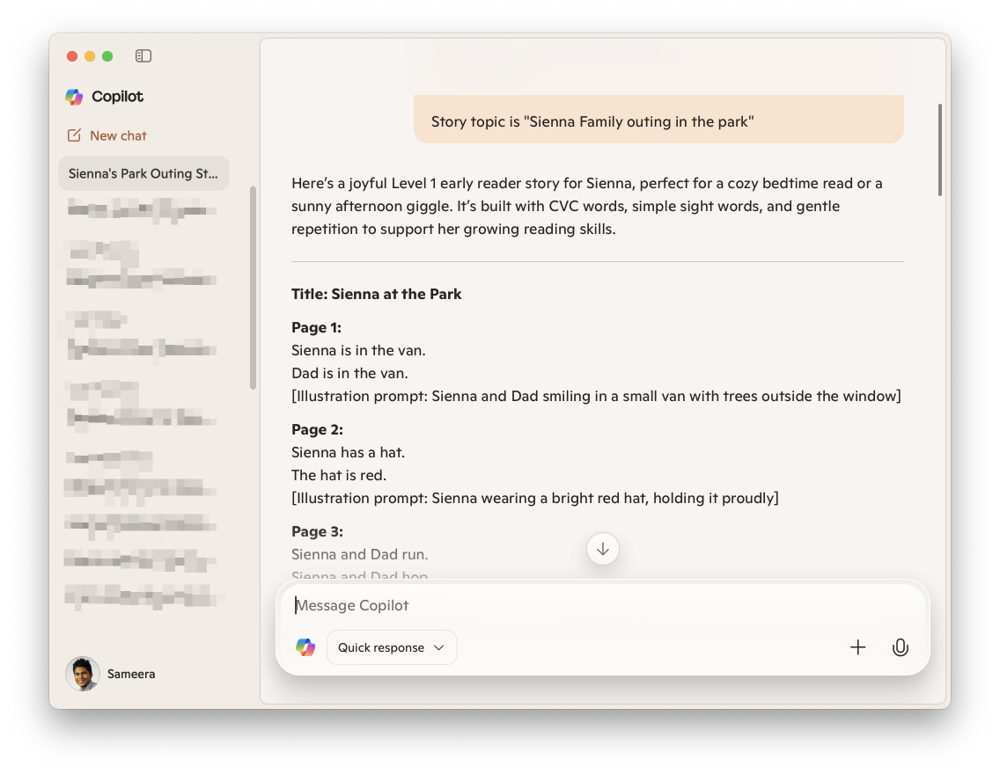
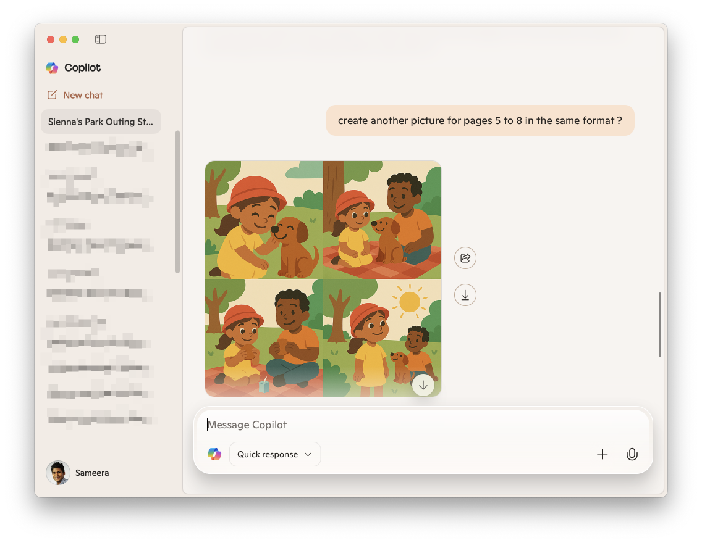
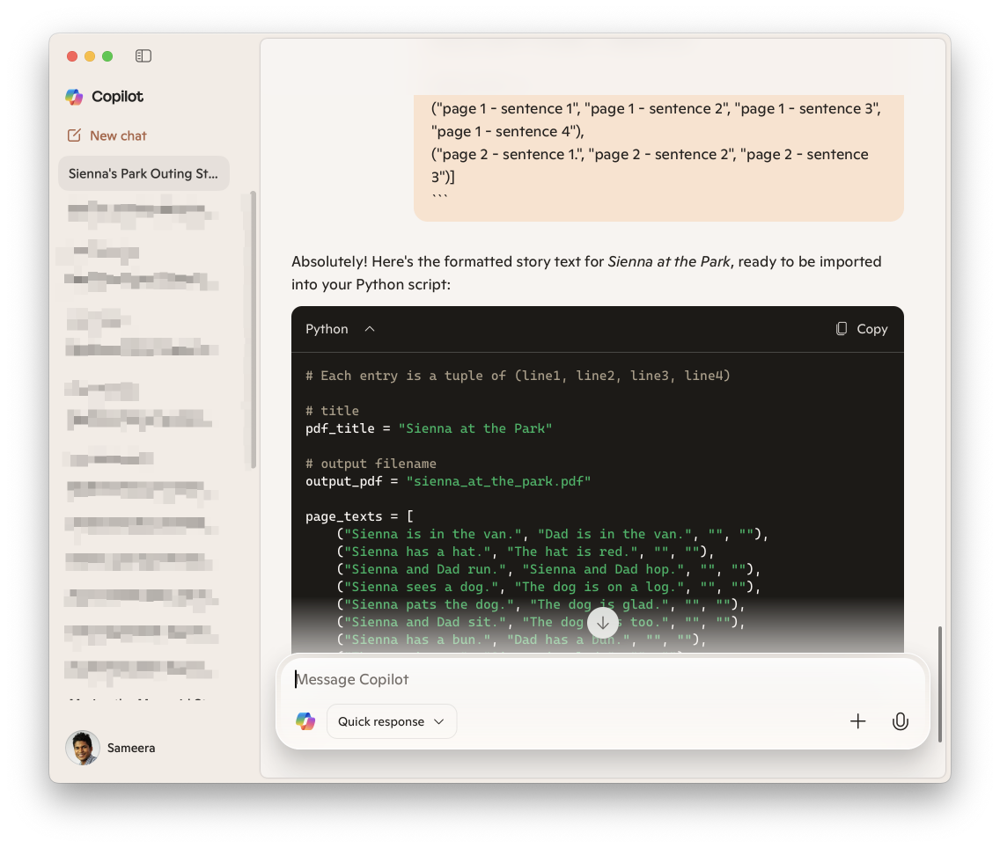
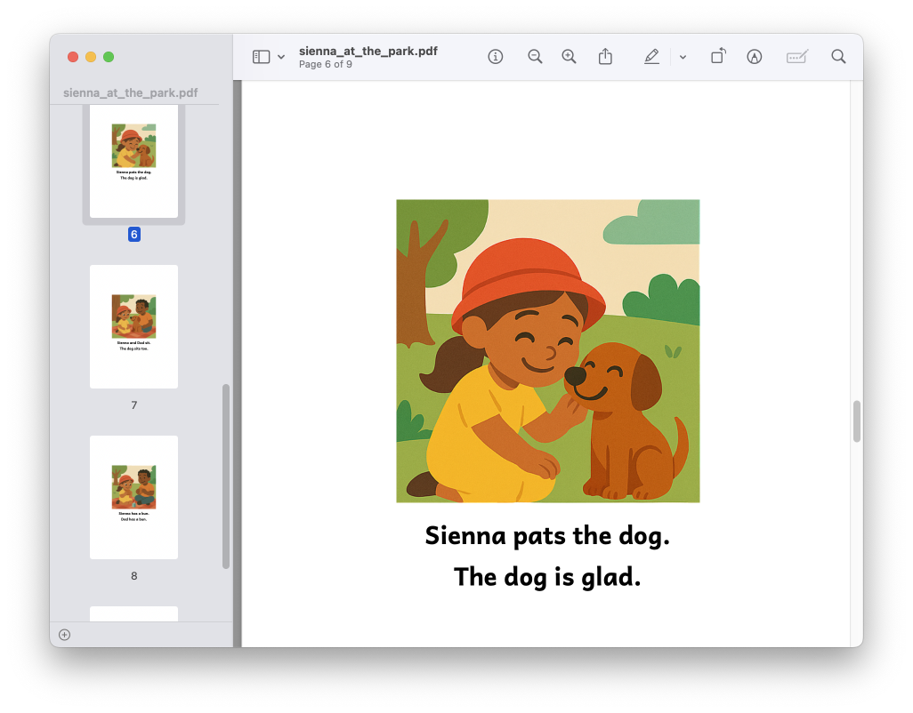
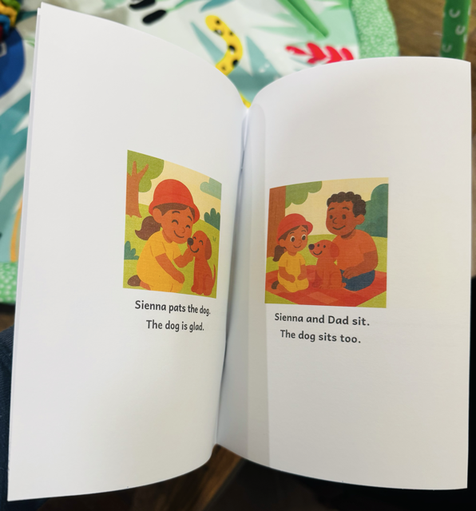

# Use AI to Create a Personalized Reading Booklet for Your Child

Helping children learn to read at home can be both exciting and challenging. One of the biggest hurdles many parents face is keeping a child engaged with the books in front of them. Kids today are full of curiosity, and their interests often change from week to week—sometimes even from day to day.

One week it might be dinosaurs, the next week mermaids, and then superheroes after that. Instead of endlessly searching for new books to match these shifting interests, you can use Microsoft 365 Copilot to generate personalized beginner-friendly books.

The best part? With [Microsoft 365 Copilot](https://www.microsoft.com/en-us/microsoft-365-copilot/download-copilot-app), you can generate both stories and illustrations directly—without needing extra tools or subscriptions.

I tried do this workflow end to end with one prompt. But that didn't work out today, however, in future, I'm pretty sure this will be possible with the advancement of AI. 

## Why Personalized Books Work So Well

Children are far more motivated to read when the story feels relevant to them. Personalization with Copilot makes this possible in two powerful ways:
1.	Your child is the main character – Their name appears in the story, making it instantly more engaging.
2.	The story connects to their real life or current interests – Maybe your child visited the zoo last weekend, or maybe they’ve been talking about sea turtles nonstop. Copilot can weave those details into a simple, easy-to-read storyline.

This combination turns reading practice into something that feels exciting and personal rather than routine.


## Creating a Personalized Booklet with Microsoft 365 Copilot

Following is an example of a workflow how I use Microsoft 365 Copilot to AI generate a book for my daughter. 

1. **Generate the Story Text**

Start by asking Copilot to create a story around your child and their current interest. For example:

```
You are a children's book author. Write a very simple, Level 1 early reader story for a child. 
The story should: 
- Be no more than 8 pages, 
- with 2–3 short sentences per page. 
- Use mostly CVC words (cat, dog, mat, hat) and very simple sight words (the, is, on, it, said). 
- Use repetition for easier reading. 
- Center around [main character: e.g., "Sienna and a little cat"]. - Have a fun, light plot that ends happily. 
- Each page should include a short **illustration description** at the end (in brackets) for image generation later. 

Format like this: 
Page 1: Text … [Illustration prompt …] 
Page 2: Text … [Illustration prompt …] ... 
until Page 8. 

Story topic is "Sienna Family outing in the park"
```


2. **Generate the Illustrations**

Once you have the story, ask Copilot to create matching illustrations. To keep things neat, generate four pages at a time:
```
Create a children’s storybook illustration in a clean, modern style with soft pastel colors, rounded bold shapes, and a friendly tone. 
No text in the image. 
No borders or dividers. 

The character [Sienna: a girl with brown hair in a ponytail, wearing a yellow dress] should appear consistently across all images. 
Use the following scene description for this page: [insert page’s illustration prompt here]. Generate one image for the first 4 pages. Divide the image into equal 4 sections. In each box, represent an image for each page. Don't include any borders or dividers.

```
second image
```
create another image for pages 5 to 8 in the same format. 
```



3. **Format the Booklet in printable PDF**

You can copy the story text into a simple script or even paste it into Word. If you’d like PDF, you can use the prompts and the python script provided generate a printable PDF.
```
Generate me the story text in the following format. I'm going to import this into a python script. Following is an example. 

```
```
# Each entry is a tuple of (line1, line2, line3, line4) 

# title 
pdf_title = "<title>" 
# output filename 
output_pdf = "<output_filename>.pdf" 

page_texts = [ 
("page 1 - sentence 1", "page 1 - sentence 2", "page 1 - sentence 3", "page 1 - sentence 4"), 
("page 2 - sentence 1.", "page 2 - sentence 2", "page 2 - sentence 3")
] 
```



Use this output and the python script [`generate_book_v2.py`](generate_book_v2.py) provided to generate the pdf. You can replace the existing `pdf_title`, `output_pdf` and `page_texts` with your own values. 

You will need to install `Pillow` and `reportlab` if you are running this for the first time in python. 
```
pip install Pillow reportlab
```




4. **Print and Read Together**
Print the booklet, staple it, and your child has a new, personalized storybook to enjoy—often the very same day.



## Final Thoughts

With Microsoft 365 Copilot, parents can go beyond generic reading books and create personalized booklets that make reading practice fun and meaningful. By combining simple vocabulary with characters and themes your child loves, you can turn learning into an adventure they look forward to.

At the end of the day, nothing beats the smile on your child’s face when they see themselves as the star of the story.